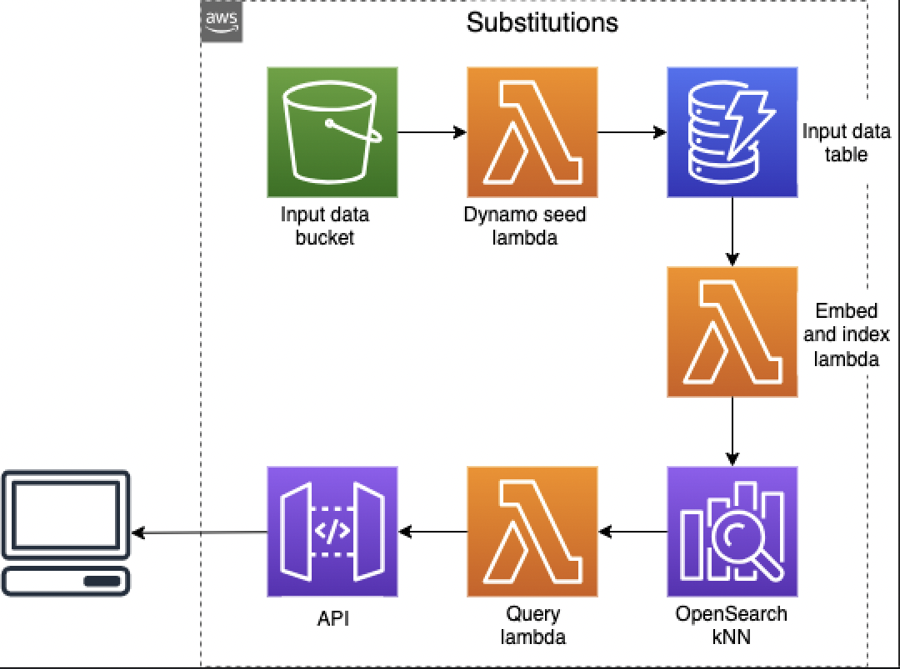

# Grocery Store Substitutions with OpenSearch and NLP

The Substitutions demo is an example of how one can use OpenSearch's kNN feature in combination with Natural Language Processing to produce recommendations for replacing out of stock grocery store products.

In this solution, grocery store product names and descriptions are converted into embeddings using the [all-MiniLM-L6-v2 sentence transformer](https://huggingface.co/sentence-transformers/all-MiniLM-L6-v2), and stored in a kNN index. When querying for product recommendations, neighbouring products are located within the kNN index and returned to the user. The relevance of returned products is increased with additional optional category and price-based pre-filtering.

## Architecture



## Deployment

The project is built using CDK IaC. So it can be deployed to your AWS account with a single cdk deploy command.

### Pre-requisites

- Ensure your AWS credentials are in place for your account
- Ensure you have [Node.js](https://nodejs.org) and [Docker](https://www.docker.com/products/docker-desktop/) installed

### Deploy stack

1. Clone this repo.
1. Bootstrap your account, in the root folder, run the following commands

   ```
   npm ci
   npm run cdk bootstrap -- --toolkit-stack-name CDKToolkit-Substitutions --qualifier subs
   ```

1. Run the following commands
   ```
   npm run cdk deploy
   ```
1. For any future changes you just need to redeploy using `npm cdk run deploy`

## Loading your data

### Formatting

You must provide your data in [JSON Lines](https://jsonlines.org/) format. Each line must represent a separate, unique product.

Required fields:

- `id` (string) - the unique product ID
- `title` (string) - the product name

Highly desired fields:

- `description` (string) - a product description, preferably less than 256 words (due to limitations of the sentence transformer)
- `categories` (string[]) - an array of categories with highest-level category (e.g. Drinks) at position 0, and lowest level category at the end (e.g. Oat Milk). We recommend a constant number of categories for each product. For example, 3: (Drinks > Vegan Milk > Oat Milk), (Drinks > Soft Drinks > Cola), (Food > Meat > Chicken).
- `price` (float) - the list price of the product; optionally used to filter for products with similar price.

Other reserved, optional fields:

- `brand` (string) - categorical fields containing the brand, must be consistently spelled.
- `allergens` (string[]) - known allergens of the product as an array; again with consistent spelling, e.g. ['wheat', 'nuts']
- `diet_type` (string[]) - an array containing e.g. ['vegan', 'kosher', 'gluten free']

You may also include other customised fields but these will not affect how substitutions are calculated.

### Indexing

1. Upload one or more JSON Lines file named (with `.jsonl` suffix) to the input S3 bucket, named `<ACCOUNT>-<REGION>-substitutions-input-bucket`. Each line should contain a product with at least `id`, `title` (see _Formatting_).

1. The seed lambda is triggered every time a file is uploaded to the bucket. This populates the dynamo DB table and also indexes each product into OpenSearch. The indexing process can take a long time. You can check if it is finished by calling the `/status` API method and checking that `products_in_table` matches `products_in_opensearch`.

### Sample data

The sample data provided in `./sample-data/instacart.jsonl` is taken from the [Kaggle Instacart dataset](https://www.kaggle.com/competitions/instacart-market-basket-analysis/data?select=products.csv.zip). It has been parsed to satisfy the formatting requirements of this solution. It contains a list of products with `id`, `title`, and `categories`.

Due to the lack of `price` field you cannot use the `price_factor` filter (see _Filtering_).

## Requesting substitutions

You can request substitutions by querying the `/substitutions?id=<PRODUCT_ID>` of your API. The API endpoint is printed by the CDK CLI after deployment, and is also available by looking in the outputs section of the cloudformation stack in the console.

**Note**
The api is protected by a lambda [authorizer](./lib/api/api-construct.auth.ts), make sure to add an Authorization header with any dummy value in order to call the endpoint successfully e.g `curl https://<API_Endpoint>/substitutions\?id\=<PRODUCT_ID> -H Authorization:auth`. For future use please add your own security logic in the auth lambda.

### Filtering

There are currently a few in-built knn pre-filters on this solution, all of which are utilised by passing extra query string parameters to the API call:

For example: `/substitutions?id=<PRODUCT_ID>&category_match_level=0&price_factor=1.5`

**Note**
But currently the sample data used doesn't contain prices and other fields required for further filtering. But once you replace with your own real data, you can take advantage of these extra queries

#### Recommended for use on all queries

- `category_match_level`:

  - a value of 0 will require that the full category list of any candidate sub must match the list of the query product, thus enforcing category equality: `[cat1, cat2, cat3, cat4, cat5]`.
  - a positive value will match up to and excluding the specified index. For example 2 will require that the first two categories match `[cat1, cat2, , , ]`
  - a negative value will match up to and excluding the Python-style [negative index](https://www.tutorialspoint.com/what-is-a-negative-indexing-in-python#:~:text=Negative%20Indexing%20is%20used%20to,i.e.%20start%2C%20stop%20and%20step.) of the category list. So for -2, `[cat1, cat2, cat3, , ]`

- `price_factor`:
  - Specifies the variation in price from the original product that can be tolerated.
  - E.g. 1.5 will allow products with `orig_price/1.5 < price < orig_price*1.5`

#### Additional filters

- `diet_type_match_count`:

  - a value with 0 requires that all `diet_type` terms are matched
  - a value (`d`) of 1 to `len(query_product['diet_type'])` require that `d` `diet_type` terms match

- `brand_match`:

  - a value of `true` returns products of same brand.

- `no_new_allergens`:

  - a value of `true` returns products that do not contain allergens that are not found in the query product. For example, if the query product contains ['wheat', 'nuts'], only products with [], ['wheat'], ['nuts'], ['wheat', 'nuts'] will be returned.

- `custom_filter_script`:
  - a value of `true` will run the additional filtering script that is defined in `/lib/api/lambdas/substitutions/custom_filter_script.py`. You may modify this file to add custom filtering to your deployment.

## Additional API functions

As well as the main subs API endpoint at `/substitutions` (GET), there are two additional API methods:

- `/add-product` (POST) - accepts a new product in JSON format as the body to be added to the dataset. This is for one-at-a-time product adds; larger batches should be uploaded to S3.
- `/status` (GET) - returns the number of products in the opensearch index and in the dynamo table. This is to give an indication on the progress of the indexing. Indexing has finished when these two values match.

## Clean up

To remove all resources created by this stack run the following

```
npm run cdk destroy
```

## Security

See [CONTRIBUTING](CONTRIBUTING.md#security-issue-notifications) for more information.

## License

This library is licensed under the MIT-0 License. See the [LICENSE](LICENSE) file.
